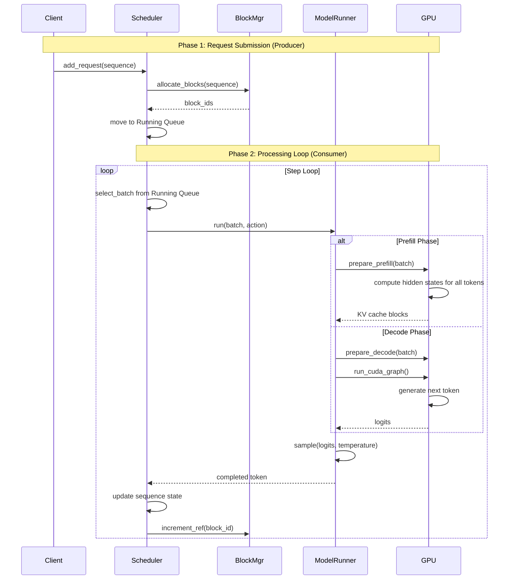

# Nano-vLLM Architecture Diagram

Based on: https://neutree.ai/blog/nano-vllm-part-1

## System Architecture

```mermaid
flowchart TD
    subgraph "User Layer"
        U1[Client API\nLLM.generate]
        U2[add_request\n(producer)]
    end

    subgraph "Scheduler\n(Thread 1)"
        S1[Waiting Queue]
        S2[Running Queue]
        S3[Batch Selector]
    end

    subgraph "Step Loop\n(Thread 2 - Consumer)"
        L1[Step Loop]
        L2[Model Runner]
    end

    subgraph "Memory Management\n(CPU Control Plane)"
        M1[Block Manager]
        M2[Block Allocator]
        M3[Prefix Caching\n(hash-based)]
    end

    subgraph "GPU Data Plane"
        G1[Prefill Kernel]
        G2[Decode Kernel]
        G3[CUDA Graphs]
        G4[Sampler]
    end

    subgraph "GPU Memory"
        GMem[KV Cache Blocks]
    end

    U2 --> S1
    S1 -->|prefill| S2
    S2 --> S3
    S3 --> L1
    L1 --> L2
    L2 --> G1
    L2 --> G2
    G1 --> GMem
    G2 --> GMem
    G2 --> G3
    G3 --> G4
    G4 -->|new token| S2
    S3 -->|request| M1
    M1 --> M2
    M2 --> GMem
    M1 -->|hash| M3

    style S1 fill:#f9f7ed,stroke:#333,stroke-width:2px
    style S2 fill:#f9f7ed,stroke:#333,stroke-width:2px
    style M1 fill:#e8f5e9,stroke:#333,stroke-width:2px
    style GMem fill:#fce4ec,stroke:#333,stroke-width:2px
    style L1 fill:#e3f2fd,stroke:#333,stroke-width:2px

    note1["Producer: add_request adds sequences to Waiting Queue\nConsumer: step loop pulls from Running Queue\nPrefill: Process all input tokens, populate KV cache\nDecode: Generate one token per step, reuse CUDA graphs\nBlock Manager: CPU tracks metadata, GPU holds actual cache"]
    note1 -.-> S1
    note1 -.-> S2
```

## Data Flow Diagram



## Key Concepts Summary

- **Producer-Consumer Pattern**: `add_request` (producer, main thread) → Scheduler queue → `step loop` (consumer, separate thread)
- **Two-Phase Inference**: 
  - *Prefill*: Process all input tokens at once, populate KV cache
  - *Decode*: Generate one token per step, reuse CUDA graphs
- **Block Manager**: CPU-side control plane tracking KV cache blocks with hash-based prefix caching
- **CUDA Graphs**: Record-and-replay for decode steps to reduce kernel launch overhead
- **Tensor Parallelism**: Leader-worker pattern for multi-GPU inference
- **Memory Efficiency**: Prefix caching avoids redundant KV cache storage for common prefixes

## Architecture Highlights

- **Two threads**: Main thread for request submission, separate thread for inference loop
- **GPU memory optimization**: KV cache blocks with reference counting
- **Kernel optimization**: CUDA graphs for decode, torch.compile for prefill
- **Scalability**: Tensor parallelism for multi-GPU setups